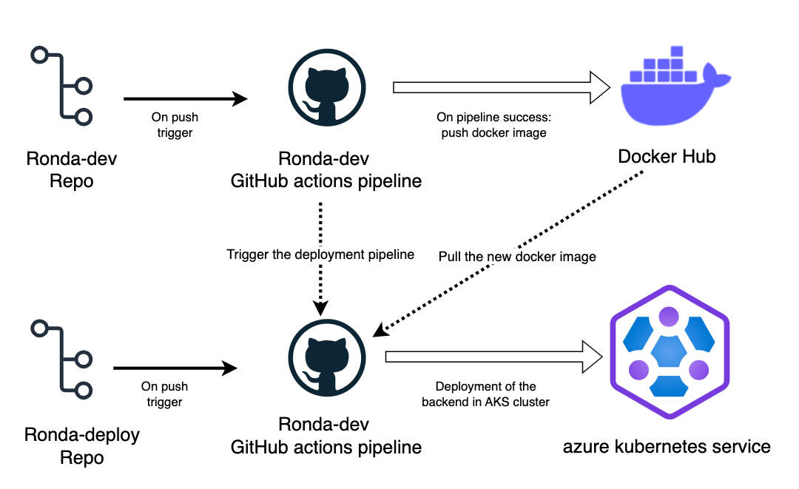
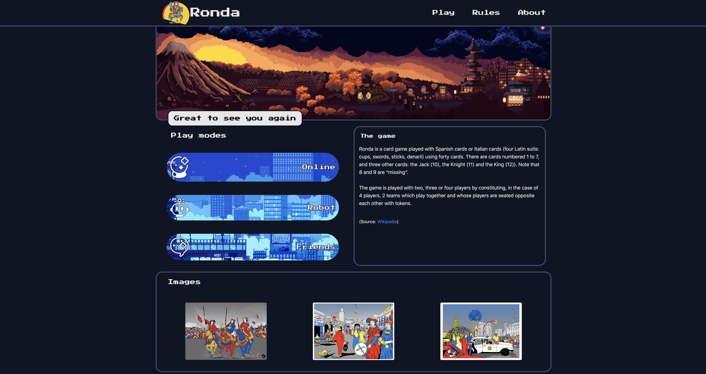
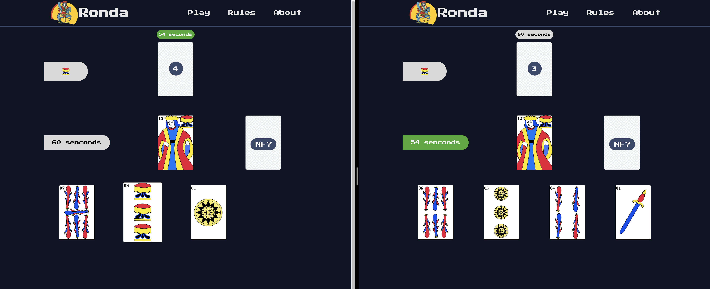
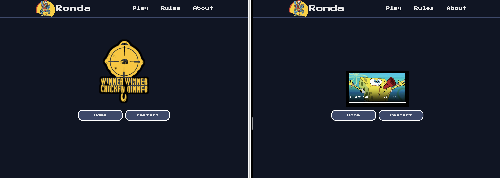
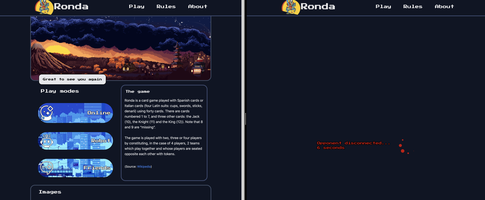

# **RONDA Deployment Repository**
## Overview
- Ronda Deployment is a repository of the code base of the k8s manifests of the game backend [Backend repository](https://github.com/ozennou/Ronda-dev).
## **DevOps part**
- In the DevOps part I create a CI/CD pipelines using GitHub actions for building, testing and pushing the backend docker image to [Docker-Hub]() of [Ronda-dev](https://github.com/ozennou/Ronda-dev) and also trigger other pipeline in this repository that deploy the backend in AKS cluster:

## **Backend part**
- In this part I work using django websockets to create a real time game, when a player want to start a game fistly get connected to the matchmaking websocket that use a queue to create a game between two players and redirect them to the new game websocket uri when the game logic started:

 
 
 
 
 
 
 
 
